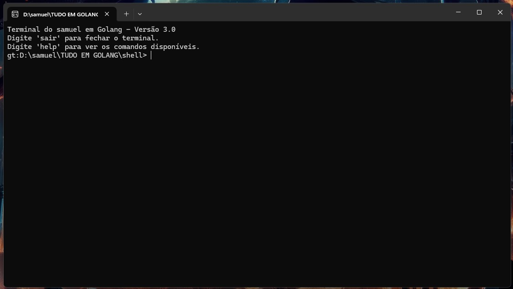

 #  Desenvolvido com 💻 e Go!

# Golang Terminal

**Golang Terminal** é um terminal customizado desenvolvido em Go que oferece funcionalidades básicas para navegação e manipulação de arquivos no sistema. Este projeto serve como uma introdução prática ao desenvolvimento de aplicações de terminal e ao uso de comandos do sistema operacional com a linguagem Go.

## Funcionalidades

O terminal suporta os seguintes comandos:

- **ls**: Lista arquivos e diretórios no diretório atual.
- **echo [msg]**: Exibe uma mensagem no terminal.
- **mkdir [nome]**: Cria um novo diretório.
- **cd [path]**: Altera o diretório atual para o especificado.
- **rm [nome]**: Remove um arquivo ou diretório.
- **cat [nome]**: Exibe o conteúdo de um arquivo.
- **clear**: Limpa a tela do terminal.
- **sysinfo**: Exibe informações sobre o sistema operacional e o usuário atual.
- **date**: Exibe a data e hora atuais.
- **history**: Exibe o histórico de comandos digitados na sessão.
- **touch [nome]**: Cria um novo arquivo vazio.
- **help**: Exibe a lista de comandos disponíveis.
- **sair**: Fecha o terminal.

## Instalação

Para compilar o terminal, você precisará ter o Go instalado. Siga os passos abaixo para instalar e configurar o projeto.

1. Clone o repositório ou copie o código para um arquivo local.
2. Navegue até o diretório onde o arquivo foi salvo.
3. Compile o programa usando o comando:

    ```sh
    go build -o golang_terminal golang_terminal.go
    ```

4. Um arquivo executável chamado `golang_terminal` será criado (no Windows, ele será `golang_terminal.exe`).

## Uso

Após compilar o projeto, você pode executar o terminal customizado. 

No **Linux** ou **Mac**:
```sh
./golang_terminal

## exemplos

# Lista arquivos no diretório atual
ls

# Cria um novo diretório chamado 'meu_diretorio'
mkdir meu_diretorio

# Altera o diretório atual para 'meu_diretorio'
cd meu_diretorio

# Cria um arquivo vazio chamado 'arquivo.txt'
touch arquivo.txt

# Exibe o conteúdo de 'arquivo.txt'
cat arquivo.txt

# Remove 'arquivo.txt'
rm arquivo.txt

# Exibe informações sobre o sistema
sysinfo

# Exibe a data e hora atuais
date

# Limpa a tela
clear

# Exibe o histórico de comandos
history
Contribuindo
Sinta-se à vontade para contribuir com o projeto, enviando pull requests ou sugestões. Este projeto é uma ótima oportunidade para aprender mais sobre a linguagem Go e o desenvolvimento de interfaces de linha de comando.


markdown
Copiar código

### Observações
1. **Seção de Imagens**: Como suas imagens estão no diretório `./fotos_do_projeto/`, o código acima presume que estão no formato `.jpg`. Certifique-se de que os arquivos de imagem tenham a extensão correta. 
2. **Imagens Centradas e Alinhadas**: As imagens aparecerão lado a lado em telas largas e uma abaixo da outra em telas menores, facilitando a visualização.
  
O README está agora completo e pronto para uso!
````
📸 Imagens do Projeto
<p align="center">   </p>
